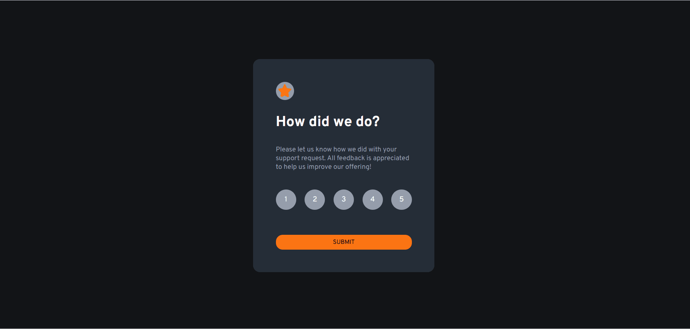

# Projeto Interective Rating Component

Este projeto é o meu primeiro projeto do Frontend Mentor de JavaScript que realizei sozinho. O objetivo principal deste projeto foi treinar minhas habilidades e conhecimentos adquiridos em JavaScript (JS).<br>



Para que essas duas telas surgissem, foi criado duas *divs* - uma é a principal e a outra que fica escondida com o *display: none* e que aparece por meio da lógica no JavaScript. <br>
O principal da lógica utilizada neste projeto foi utilizar o Evento de *click* para selecionar um número e depois outro Evento de *click* para o botão. Cada um dos números dessa lista foi armazenado em uma variável que permitiu que ficasse selecionado após o clique do mouse. 

```
numberSelected.forEach((number) => {
    number.addEventListener('click', () => {
        numberSelected.forEach(n => n.classList.remove('ativo'));

        number.classList.add('ativo');

        selectedRating = number.textContent;
    })
})
```

A classe "ativo" foi criada no CSS e utilizada no JavaScript. Essa classe é responsável por alterar o número e especificar qual foi clicado. (A variável "selectedRating" foi criada com o valor nulo (null)).<br>
Para a lógica do botão, foi avaliado se realmente há um número clicado e então adiciona-se esse número no *span* presente na segunda *div* no HTML para que mostre a mensagem indicando quando foi o número selecionado dentre os 5. Além disso, com a classe "hidden" ela é adicionada e removida das duas *divs*, permitindo a troca de telas.

```
btnSelected.addEventListener('click', () => {
    if(selectedRating) {
        document.getElementById('rating-selected').textContent = selectedRating;

        document.querySelector('.container-rating').classList.add('hidden')

        document.querySelector('.container-thanks').classList.remove('hidden')
    } else {
        alert('Por favor, selecione uma nota antes de enviar')
    }
})
```

Como um extra, foi adicionado um Alerta na página caso o usuário não selecione nenhum número (nota) e clique no botão. 

## Tecnologias Utilizadas 
HTML, CSS, JavaScript (JS)

## Conclusão
Como o objetivo desse projeto foi exercitar a lógica de programção com o JavaScript, consegui perceber uma evolução em comparação com projetos anteriores. Neste projeto, consegui, com mais precissão, aplicar minha capacidade de analisar e pensar no que precisa ser feito e, aos poucos, montar na prática. 